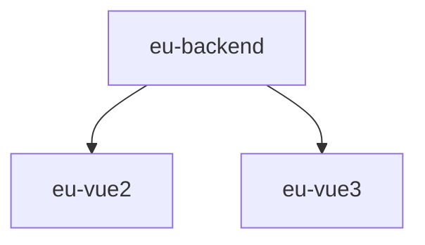

# 介绍

<h1 align="center">EuBackend</h1>

基于SpringBoot开发的轻量级快速开发平台

    
    

<strong>EuBackend</strong>是一套全部开源的前后端分离 Java EE 企业级快速开发平台，基于最新技术栈`SpringBoot`、`Sa-Token`、`MyBatisPlus`等作为后端框架，使用RBAC作为权限控制模型，并且毫无保留给个人及企业免费使用。

- 演示地址：暂无

## 项目特性
- 简洁而不简单的RBAC权限管理体系
- 强大的代码生成功能（从sql>mapper>java>前端页面 全部搞定）
- 数据权限控制，通过注解轻松实现
- 强大的登录体系：检查验证码、密码错误次数、账号状态等
- 完善的日志记录体系简单注解即可实现
- 完善的XSS防范及脚本过滤，彻底杜绝XSS攻击
- 封装Excel导入导出，数据量大也不怕，使用更简单
- 动态数据源，可以轻松实现多数据源切换

## 项目生态
- 后端服务：[eu-backend](https://gitee.com/zhaoeryu/eu-backend)
- 前端-Vue2：[eu-vue2](https://gitee.com/zhaoeryu/eu-vue2)
- 前端-Vue3：[eu-vue3](https://gitee.com/zhaoeryu/eu-vue3)

它们之间的关系如下👇

## 内置功能
1. 用户管理
2. 部门管理
3. 岗位管理
4. 角色管理
5. 菜单管理
6. 字典管理
7. 通知公告
8. 在线用户
9. 定时任务
10. 操作日志
11. 代码生成
12. API管理

## 其他说明
- 默认登录账号：admin，密码：admin123

## 技术交流群

